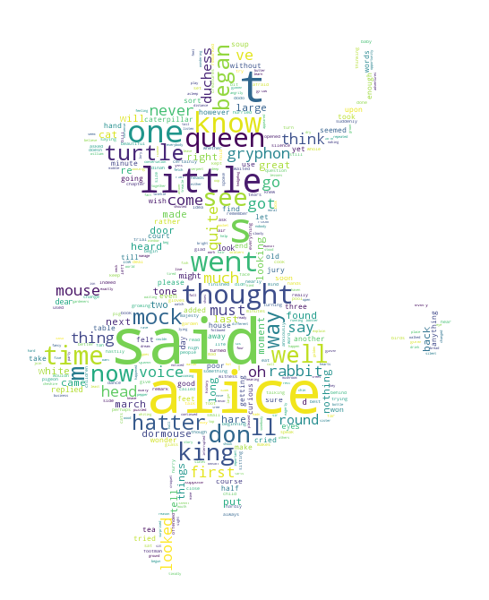

# Cloudera Data Science Workbench demos
Basic tour of Cloudera Data Science Workbench.

## Workbench
There are 4 scripts provided which walk through the interactive capabilities of Cloudera Data Science Workbench.

1. **Basic Python visualizations (Python 2).** Demonstrates:
  - Markdown via comments
  - Jupyter-compatible visualizations
  - Simple console sharing
2. **PySpark (Python 2).** Demonstrates:
  - Easy connectivity to (kerberized) Spark in YARN client mode.
  - Access to Hadoop HDFS CLI (e.g. `hdfs dfs -ls /`).
3. **Tensorflow (Python 2).** Demonstrates:
  - Ability to install and use custom packages (e.g. `pip search tensorflow`)
4. **R on Spark via Sparklyr (R).** Demonstrates:
  - Use familiar dplyr with Spark using [Sparklyr](http://spark.rstudio.com)
  - Run Shiny app

## Setup Instructions
You can run the following to cover all setup tasks once:

1. Stop any workbench sessions.

2. Run scripts in SETUP directory. Use R session for setup_R_pkgs.R from inside CDSW (this can take awhile)

3. Run a python session and run the rest of the shell scripts in any order

4. Change code in 5_ibis.py to connect to your Impala daemons.

## Files
```
.
├── 1_python.py
├── 2_pyspark.py
├── 3_spark_wordcloud.py
├── 4_tensorflow.py
├── 5_ibis.py
├── 6_sparklyr.R
├── 7_shiny.R
├── IMAGES
│   ├── alice-mask.jpg
│   └── alice_readme.png
├── MISC
│   ├── _bashrc
│   ├── _gitignore
│   └── scratch
│       └── 4.1_sparklyr.R
├── README.md
├── SETUP
│   ├── requirements.txt
│   ├── setup_R_pkgs.R
│   ├── setup_airline_data.sh
│   ├── setup_ibis.sh 
│   └── setup_python_packages.sh
├── UTILS
│   ├── __init__.py
│   ├── env_utils.R
│   ├── env_utils.py
│   └── tensor_utils.py
├── alice-mask.jpg
├── app
│   ├── server.R
│   └── ui.R
├── data
│   ├── GoogleTrendsData.csv
│   ├── MNIST
│   │   ├── t10k-images-idx3-ubyte.gz
│   │   ├── t10k-labels-idx1-ubyte.gz
│   │   ├── train-images-idx3-ubyte.gz
│   │   └── train-labels-idx1-ubyte.gz
│   └── kmeans_data.txt
├── save.md
├── server.R
├── tmp
│   ├── alice30.txt
│   └── alice_wc.png
└── ui.R
```

## Jobs
We recommend setting up a **"Nightly Analysis"** job to illustrate how data scientists can easily automate their projects.

## Misc files
_bashrc
_gitignore

* From a terminal window: cp /home/cdsw/MISC/_gitignore /home/cdsw/.gitignore
* Optional: cp /home/cdsw/MISC/_bashrc /home/cdsw/.bashrc


## For "Alice In Wonderland" word cloud
### Dan Modifications
#### NLP example: Wordcloud "ALICE'S ADVENTURES IN WONDERLAND"

This code is inspired from https://github.com/amueller/word_cloud/blob/master/examples/masked.py



